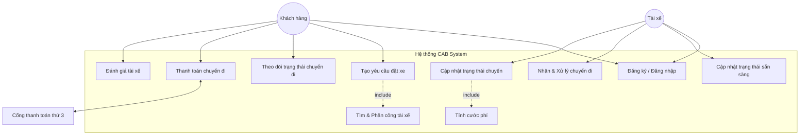
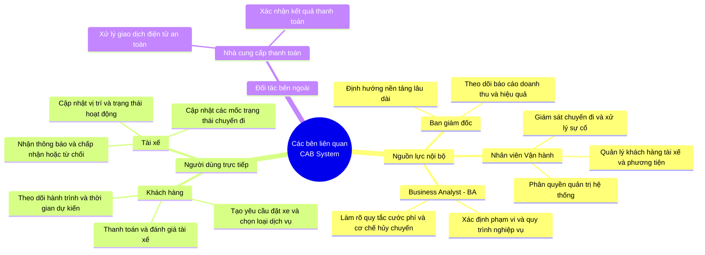
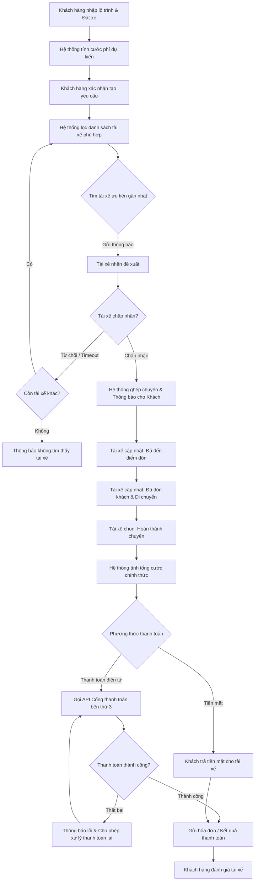

# 23634811_TruongPhucHuy_capsystem

**Dự án: Nền tảng Đặt xe Trực tuyến (CAB System)**

---

## 1. Yêu cầu của Khách hàng (Customer Requirements)

### Phân hệ Khách hàng
* Đăng ký tài khoản, đăng nhập, cập nhật thông tin cá nhân
* Nhập điểm đón, điểm đến, lựa chọn loại xe, gửi yêu cầu đặt xe và theo dõi chuyến đi
* Nhận thông tin chi tiết trạng thái: hệ thống đang tìm tài xế, tài xế nhận chuyến, thời gian dự kiến đến (ETA) và trạng thái hiện tại của chuyến đi
* Xem lịch sử chuyến đi, số tiền phải trả và đánh giá tài xế sau khi hoàn thành[

### Phân hệ Tài xế
* Đăng ký tài khoản trực tiếp hoặc được nhân viên vận hành tạo tài khoản, cập nhật hồ sơ, thông tin phương tiện và trạng thái hoạt động
* Chuyển trạng thái sẵn sàng nhận chuyến khi làm việc
* Nhận thông báo khi có yêu cầu phù hợp, chấp nhận hoặc từ chối chuyến
* Cập nhật các mốc trạng thái trong quá trình chạy: đã đến điểm đón, đã đón khách, đang di chuyển, hoàn thành chuyến
* Lưu thông tin vị trí thời gian thực để hỗ trợ tìm tài xế gần nhất và cải thiện dự kiến thời gian đến

### Cơ chế Tìm và Phân công Tài xế
* Xác định tài xế phù hợp dựa trên vị trí, trạng thái sẵn sàng và tiêu chí vận hành ưu tiên tài xế gần khách hàng
* Cơ chế tự động xử lý khi tài xế được đề xuất không phản hồi hoặc từ chối: tiếp tục tìm tài xế khác mà không bắt khách hàng tạo lại yêu cầu
* Thông báo rõ ràng cho khách hàng trong trường hợp không tìm được tài xế
* 
### Tính cước và Thanh toán
* Xác định số tiền khách hàng phải trả dựa trên loại dịch vụ và thông tin chuyến đi sau khi hoàn thành
* Hỗ trợ thanh toán bằng tiền mặt hoặc phương thức thanh toán điện tử thông qua nhà cung cấp bên ngoài
* Không lưu trữ thông tin nhạy cảm của thẻ hoặc tài khoản thanh toán trực tiếp trong hệ thống CAB
* Thông báo cho khách hàng và cho phép xử lý lại theo chính sách khi giao dịch điện tử thất bại

### Hệ thống Thông báo
* Gửi thông báo cho khách hàng khi: yêu cầu được tiếp nhận, có tài xế nhận chuyến, tài xế đến điểm đón, hoàn thành chuyến và kết quả thanh toán
* Gửi thông báo cho tài xế về chuyến mới hoặc thay đổi liên quan

### Phân hệ Quản trị và Vận hành
* Giao diện quản trị quản lý khách hàng, tài xế, phương tiện và chuyến đi
* Xem chuyến đang diễn ra, kiểm tra trạng thái tài xế, hỗ trợ xử lý chuyến lỗi, tra cứu lịch sử giao dịch
* Phân quyền chặt chẽ các chức năng quản trị nhạy cảm để nhân viên thông thường không thể thao tác
* Trích xuất báo cáo về số lượng chuyến, doanh thu, tỷ lệ hoàn thành, tỷ lệ hủy và hiệu quả hoạt động của tài xế

### Yêu cầu Phi chức năng & Bảo mật
* Hoạt động ổn định khi nhu cầu tăng cao; lỗi ở thanh toán hoặc thông báo không làm ngừng trệ toàn bộ hệ thống
* Khả năng mở rộng độc lập từng thành phần khi tải tăng và triển khai tính năng mới từng phần không ảnh hưởng tính năng cũ
* Xác thực tài khoản khách hàng, tài xế và kiểm soát quyền truy cập trang quản trị
* Bảo vệ thông tin cá nhân, phương tiện, dữ liệu vị trí và giao dịch; lưu vết (audit log) các thao tác quan trọng khi có sự cố

### Các điểm cần BA tiếp tục làm rõ với các bên liên quan
* Chi tiết cách tính cước
* Tiêu chí ưu tiên tài xế và thời gian phản hồi cho phép của tài xế
* Chính sách hủy chuyến và cách xử lý khi mất kết nối mạng
* Thời gian lưu trữ dữ liệu hệ thống

---

## 2. Xác định Các bên Liên quan (Stakeholders & Actors)

Ban giám đốc kỳ vọng hệ thống hỗ trợ các nhóm người dùng và bên liên quan chính sau đây
* **Khách hàng (Customer):** Người sử dụng dịch vụ trực tiếp thực hiện việc đăng ký tài khoản, nhập điểm đón/đến, gửi yêu cầu đặt xe, theo dõi hành trình chuyến đi, thanh toán cước phí và đánh giá tài xế
* **Tài xế (Driver):** Người cung cấp dịch vụ vận chuyển, thực hiện đăng ký hoặc được cấp tài khoản, cập nhật hồ sơ phương tiện, quản lý trạng thái hoạt động (sẵn sàng nhận chuyến), nhận điều phối, cập nhật trạng thái hành trình
* **Nhân viên Vận hành / Quản trị (Operator / Admin):** Bộ phận quản lý hệ thống, hỗ trợ tạo tài khoản tài xế, theo dõi các chuyến đang diễn ra, kiểm tra trạng thái tài xế, xử lý sự cố chuyến đi, tra cứu lịch sử giao dịch và xem các báo cáo thống kê
* **Ban lãnh đạo / Ban giám đốc (Management):** Người ra quyết định đầu tư, định hướng phát triển nền tảng dài hạn và yêu cầu các báo cáo về doanh thu, số lượng chuyến, tỷ lệ hoàn thành/hủy chuyến cũng như hiệu quả hoạt động của tài xế
* **Business Analyst (BA):** Chuyên viên phân tích nghiệp vụ chịu trách nhiệm làm rõ phạm vi, tác nhân, quy trình, quy tắc nghiệp vụ, các trường hợp ngoại lệ và các điểm chưa rõ với các bên liên quan trước khi xây dựng giải pháp
* **Nhà cung cấp dịch vụ bên thứ ba (Third-party Providers):** Đơn vị cung cấp cổng thanh toán điện tử và các dịch vụ hạ tầng liên quan
* 
## 3. Mục đích Nghiệp vụ (Business Objectives)
* **Số hóa và tự động hóa quy trình vận hành:** Chuyển đổi từ mô hình tổng đài thủ công sang nền tảng đặt xe trực tuyến tự động, giúp tối ưu hóa việc phân công tài xế dựa trên vị trí và trạng thái hoạt động
* **Nâng cao trải nghiệm người dùng (Khách hàng & Tài xế):** Giúp khách hàng dễ dàng đặt xe, theo dõi hành trình theo thời gian thực (ETA), minh bạch hóa cước phí và thanh toán điện tử an toàn; đồng thời giúp tài xế nhận chuyến và cập nhật hành trình thuận tiện
* **Quản lý tập trung và kiểm soát thanh toán:** Quản lý tập trung dữ liệu chuyến đi, tích hợp cổng thanh toán điện tử bên ngoài thông qua nhà cung cấp mà không lưu trữ thông tin nhạy cảm của thẻ, đảm bảo an toàn giao dịch
* **Khả năng mở rộng linh hoạt (Scalability):** Xây dựng kiến trúc hệ thống chịu tải tốt vào giờ cao điểm, các thành phần (như thanh toán, thông báo) hoạt động độc lập và dễ dàng mở rộng thêm tính năng mới trong tương lai mà không ảnh hưởng toàn bộ ứng dụng

---

## 4. Xác định Phạm vi Dự án (Project Scope - 7 Tuần)

Với mốc thời gian phát triển trong **7 tuần**, dự án tập trung xây dựng phiên bản tối thiểu khả dụng (MVP) của nền tảng đặt xe trực tuyến (CAB System). Phạm vi được phân chia rõ ràng giữa các tính năng **Cần làm (In-scope)** và **Không làm/Để lại giai đoạn sau (Out-of-scope)** để đảm bảo hoàn thành đúng hạn:

### 4.1. Các tính năng nằm trong phạm vi (In-scope)
* **Phân hệ Quản lý Tài khoản cơ bản:** 
  * Cho phép Khách hàng và Tài xế đăng ký, đăng nhập tài khoản
  * Nhân viên vận hành có thể tạo tài khoản và phê duyệt hồ sơ tài xế cơ bản trên trang quản trị.
* **Phân hệ Đặt xe và Định vị:** 
  * Khách hàng nhập điểm đón, điểm đến, lựa chọn loại dịch vụ và gửi yêu cầu đặt xe
  * Cập nhật vị trí thời gian thực của tài xế và tính toán thời gian dự kiến đến (ETA)
* **Cơ chế Phân công tài xế cơ bản:** 
  * Hệ thống tự động ghép nối chuyến đi với tài xế đang sẵn sàng ở gần khu vực điểm đón nhất.
  * Tài xế nhận thông báo, có quyền chấp nhận hoặc từ chối chuyến
* **Hành trình chuyến đi và Thanh toán:** 
  * Tài xế cập nhật các mốc trạng thái: đã đến điểm đón, đang di chuyển, hoàn thành chuyến
  * Tính cước tự động sau khi kết thúc chuyến đi và hỗ trợ thanh toán bằng tiền mặt hoặc qua cổng thanh toán điện tử cơ bản
* **Phân hệ Quản trị tối thiểu (Admin Dashboard):** 
  * Xem danh sách chuyến đi đang diễn ra, tra cứu lịch sử giao dịch và thống kê doanh thu cơ bản theo ngày/tuần

### 4.2. Các tính năng ngoài phạm vi cho giai đoạn 7 tuần (Out-of-scope)
* Các tính năng nâng cao như đặt xe hộ người khác, đặt lịch hẹn giờ trước (Schedule rides).
* Hệ thống ví điện tử tích hợp riêng trong ứng dụng hoặc cơ chế hoàn tiền tự động phức tạp.
* Chương trình khách hàng thân thiết (Loyalty points), mã giảm giá (Vouchers/Promotions) nhiều tầng.
* Các báo cáo phân tích nâng cao bằng AI hoặc dự báo nhu cầu thị trường theo giờ cao điểm.

## 4.3. Các Module Cần thiết cho Hệ thống (System Modules)

Dựa trên các yêu cầu nghiệp vụ và các bên liên quan, hệ thống CAB System cần được chia thành các module chính sau đây
* **Module Quản lý Người dùng (User Management Module):** Quản lý thông tin tài khoản, đăng ký, đăng nhập và phân quyền cho Khách hàng, Tài xế, Nhân viên Vận hành và Ban quản trị[
* **Module Đặt xe & Điều phối (Booking & Dispatching Module):** Xử lý yêu cầu nhập điểm đón/đến, lựa chọn loại xe của khách hàng, đồng thời thực hiện thuật toán tìm kiếm và phân công tài xế gần nhất dựa trên vị trí thời gian thực
* **Module Theo dõi Hành trình (Trip Tracking Module):** Quản lý các mốc trạng thái chuyến đi (đã nhận chuyến, đến điểm đón, đón khách, đang di chuyển, hoàn thành) và cập nhật thời gian dự kiến đến (ETA)
* **Module Tính cước & Thanh toán (Billing & Payment Module):** Tự động tính toán số tiền cước phí dựa trên chuyến đi và tích hợp cổng thanh toán điện tử thông qua nhà cung cấp bên thứ ba an toàn, không lưu trữ thông tin nhạy cảm của thẻ
* **Module Thông báo (Notification Module):** Gửi các thông báo thời gian thực đến khách hàng và tài xế qua các kênh linh hoạt (như đẩy thông báo, tin nhắn) về trạng thái chuyến đi và kết quả thanh toán
* **Module Quản trị & Báo cáo (Admin & Reporting Module):** Cung cấp giao diện cho vận hành và ban giám đốc để giám sát chuyến đi đang diễn ra, xử lý sự cố, quản lý hồ sơ tài xế/phương tiện và trích xuất các báo cáo doanh thu, hiệu suất hoạt động

## 5. Yêu cầu Nghiệp vụ (Business Requirements)

### Phân hệ Quản lý Tài khoản & Người dùng
* Hệ thống phải cho phép Khách hàng và Tài xế đăng ký tài khoản mới, đăng nhập bảo mật và cập nhật thông tin cá nhân.
* Nhân viên vận hành có quyền tạo, cập nhật hồ sơ tài xế và phương tiện, đồng thời phân quyền quản trị chặt chẽ để ngăn chặn các thao tác trái phép.

### Phân hệ Đặt xe & Điều phối (Booking & Dispatching)
* Hệ thống phải cho phép Khách hàng nhập điểm đón, điểm đến, lựa chọn loại dịch vụ và gửi yêu cầu đặt xe trực tuyến.
* Hệ thống phải tự động tính toán và phân công tài xế phù hợp dựa trên vị trí thời gian thực và trạng thái sẵn sàng, ưu tiên tài xế ở gần khách hàng nhất.
* Trong trường hợp tài xế được đề xuất từ chối hoặc không phản hồi trong thời gian quy định, hệ thống phải tự động chuyển sang đề xuất tài xế tiếp theo mà không bắt khách hàng phải tạo lại yêu cầu từ đầu.
* Hệ thống phải thông báo rõ ràng cho khách hàng nếu không tìm thấy tài xế phù hợp.

### Phân hệ Theo dõi Hành trình (Trip Tracking)
* Hệ thống phải cập nhật và hiển thị liên tục trạng thái chuyến đi theo thời gian thực (đang tìm tài xế, tài xế đã nhận chuyến, tài xế đã đến điểm đón, đang di chuyển và hoàn thành chuyến).
* Hệ thống phải tính toán và hiển thị thời gian dự kiến đến (ETA) của tài xế và hành trình.
* Khách hàng có thể xem lại lịch sử chuyến đi và đánh giá chất lượng tài xế sau khi kết thúc chuyến.

### Phân hệ Tính cước & Thanh toán (Billing & Payment)
* Hệ thống phải tự động tính toán chính xác cước phí chuyến đi dựa trên loại dịch vụ, quãng đường và thời gian sau khi hoàn thành.
* Hệ thống phải hỗ trợ đa dạng phương thức thanh toán bao gồm tiền mặt và thanh toán điện tử thông qua nhà cung cấp dịch vụ trung gian bên thứ ba.
* Hệ thống tuyệt đối không lưu trữ thông tin nhạy cảm của thẻ hoặc tài khoản thanh toán nhằm đảm bảo an toàn bảo mật.
* Khi giao dịch điện tử gặp sự cố, hệ thống phải thông báo lỗi ngay lập tức cho khách hàng và cung cấp cơ chế để thực hiện thanh toán lại.

### Phân hệ Hệ thống Thông báo (Notification)
* Hệ thống phải gửi thông báo tự động (thông qua đẩy thông báo hoặc các kênh tích hợp) đến khách hàng khi tiếp nhận yêu cầu, có tài xế nhận chuyến, tài xế đến điểm đón, kết thúc chuyến và xác nhận thanh toán.
* Hệ thống phải gửi thông báo chuyến đi mới kịp thời cho tài xế.
* Kiến trúc thông báo phải được thiết kế dạng mở rộng để dễ dàng tích hợp thêm các kênh thông báo mới trong tương lai.

### Phân hệ Quản trị & Báo cáo (Admin & Reporting)
* Hệ thống phải cung cấp giao diện quản trị giúp nhân viên vận hành theo dõi các chuyến xe đang diễn ra, kiểm tra trạng thái tài xế và xử lý sự cố phát sinh.
* Hệ thống phải cho phép trích xuất các báo cáo thống kê định kỳ hoặc theo yêu cầu về tổng số chuyến đi, doanh thu, tỷ lệ hoàn thành, tỷ lệ hủy chuyến và đánh giá hiệu suất hoạt động của tài xế.

### Yêu cầu Phi chức năng & Bảo mật (Non-Functional & Security Requirements)
* Hệ thống phải đảm bảo hiệu năng ổn định, chịu tải tốt khi lượng truy cập tăng cao vào giờ cao điểm; các lỗi ở module thanh toán hoặc thông báo không được làm sập toàn bộ hệ thống.
* Kiến trúc hệ thống phải hỗ trợ mở rộng độc lập từng thành phần (microservices hoặc modular) khi có nhu cầu tăng tải hoặc bổ sung tính năng mới.
* Hệ thống phải bảo vệ nghiêm ngặt dữ liệu cá nhân, thông tin phương tiện, tọa độ vị trí và lịch sử giao dịch; đồng thời lưu vết toàn bộ thao tác quan trọng (audit log) để phục vụ việc kiểm tra khi xảy ra sự cố.

## 6. Yêu cầu Chức năng Chi tiết (Functional Requirements)

### 6.1. Module Đặt xe & Điều phối (Booking & Dispatching)
* **FR-01 (Tính khoảng cách & Vị trí):** Hệ thống phải định vị và tính toán khoảng cách theo thời gian thực (tọa độ GPS) giữa điểm đón của khách hàng và vị trí của các tài xế xung quanh.
* **FR-02 (Cơ chế chờ tài xế chấp nhận):** 
  * Khi có yêu cầu đặt xe, hệ thống sẽ đề xuất đơn hàng cho tài xế phù hợp nhất và khởi động bộ đếm thời gian chờ phản hồi.
  * Nếu tài xế từ chối hoặc hết thời gian chờ mà không phản hồi, hệ thống phải tự động chuyển yêu cầu sang tài xế tiếp theo mà không yêu cầu khách hàng phải thực hiện lại thao tác đặt xe.
  * Trường hợp không tìm được tài xế sau khi quét toàn bộ danh sách, hệ thống phải gửi thông báo rõ ràng cho khách hàng.

### 6.2. Module Đánh giá (Rating Module)
* **FR-03 (Đánh giá tài xế):** Ngay sau khi chuyến đi hoàn thành, hệ thống phải cung cấp giao diện cho phép khách hàng chấm điểm sao (thang điểm từ 1 đến 5) và gửi phản hồi/nhận xét về chất lượng phục vụ của tài xế.
* **FR-04 (Lưu trữ & Thống kê điểm đánh giá):** Hệ thống phải ghi nhận, tổng hợp và cập nhật điểm đánh giá trung bình vào hồ sơ cá nhân của tài xế để làm cơ sở kiểm soát chất lượng vận hành.


### 7. Sơ đồ UseCase Diagram & Stakeholders

#### 🚖 Nền tảng đặt xe CAB System - Use Case Diagram


#### 🧠 Sơ đồ Tư duy Các bên Liên quan (Stakeholders Mindmap)



```


```

## 8. Đặc tả Use Case (Use Case Specification)

### 8.1. Đặc tả Use Case: Tạo yêu cầu đặt xe (Book a Ride)
* **Mô tả ngắn:** Khách hàng nhập thông tin hành trình, chọn loại dịch vụ và gửi yêu cầu để hệ thống khởi tạo chuyến đi.
* **Tác nhân chính:** Khách hàng (Customer).
* **Tiền điều kiện:** Khách hàng đã đăng nhập tài khoản thành công.
* **Hậu điều kiện:** Yêu cầu đặt xe được tạo trên hệ thống, bắt đầu kích hoạt quy trình tìm kiếm tài xế.

| STT | Luồng chính (Main Flow) |
| :--- | :--- |
| 1 | Khách hàng chọn chức năng "Đặt xe" trên ứng dụng. |
| 2 | Khách hàng nhập điểm đón, điểm đến và chọn loại xe/dịch vụ. |
| 3 | Hệ thống tính toán, hiển thị quãng đường và cước phí dự kiến. |
| 4 | Khách hàng chọn phương thức thanh toán (Tiền mặt / Điện tử) và xác nhận gửi yêu cầu. |
| 5 | Hệ thống ghi nhận chuyến đi, chuyển trạng thái sang "Đang tìm tài xế" và gọi thuật toán phân công[cite: 1]. |
| 6 | Khách hàng nhận được thông báo hệ thống đang xử lý tìm tài xế[cite: 1]. |

| Mã lỗi / Luồng ngoại lệ | Luồng thay thế (Alternative / Exception Flow) |
| :--- | :--- |
| **E1: Nhập thiếu / sai vị trí** | Hệ thống cảnh báo vị trí không hợp lệ và yêu cầu khách hàng chọn lại từ bản đồ/gợi ý. |
| **E2: Không tìm thấy tài xế** | Nếu qua hết danh sách tài xế ưu tiên mà không ai nhận, hệ thống thông báo "Không tìm thấy tài xế" và hỏi khách hàng có muốn đặt lại không[cite: 1]. |

---

### 8.2. Đặc tả Use Case: Tiếp nhận và thực hiện chuyến đi (Process Ride)
* **Mô tả ngắn:** Tài xế nhận thông báo chuyến đi, chấp nhận chuyến và cập nhật tiến trình cho đến khi hoàn thành[cite: 1].
* **Tác nhân chính:** Tài xế (Driver)[cite: 1].
* **Tiền điều kiện:** Tài xế đang ở trạng thái "Sẵn sàng nhận chuyến" và có vị trí GPS hợp lệ[cite: 1].
* **Hậu điều kiện:** Chuyến đi hoàn tất, hệ thống chuyển sang bước tính cước và thanh toán[cite: 1].

| STT | Luồng chính (Main Flow) |
| :--- | :--- |
| 1 | Tài xế nhận được thông báo đề xuất chuyến đi mới kèm điểm đón/đến[cite: 1]. |
| 2 | Tài xế chọn "Chấp nhận" chuyến đi trong thời gian quy định[cite: 1]. |
| 3 | Hệ thống cập nhật trạng thái chuyến sang "Đã có tài xế" và thông báo cho khách hàng[cite: 1]. |
| 4 | Tài xế di chuyển đến điểm đón và ấn cập nhật "Đã đến điểm đón"[cite: 1]. |
| 5 | Khi khách lên xe, tài xế ấn cập nhật "Đã đón khách / Đang di chuyển"[cite: 1]. |
| 6 | Đến nơi, tài xế ấn "Hoàn thành chuyến đi", hệ thống ghi nhận mốc thời gian kết thúc[cite: 1]. |

| Mã lỗi / Luồng ngoại lệ | Luồng thay thế (Alternative / Exception Flow) |
| :--- | :--- |
| **E1: Tài xế từ chối / Hết thời gian**| Nếu tài xế ấn "Từ chối" hoặc không phản hồi sau thời gian timeout, hệ thống tự động chuyển yêu cầu sang tài xế tiếp theo mà khách hàng không cần tạo lại lệnh đặt[cite: 1]. |

---

## 9. Phân tích Quy trình Nghiệp vụ (Business Process Analysis)

Quy trình nghiệp vụ cốt lõi từ khi Khách hàng gửi yêu cầu đến khi Hoàn tất chuyến đi và Đánh giá:



```


```
## 10. Phân tích các Quy tắc Nghiệp vụ (Business Rules)
### 10.1. Quy tắc Ưu tiên và Phân công Tài xế (Driver Matching Rules)
*BR_MATCH_01 (Xác định tài xế phù hợp): Chỉ đề xuất chuyến đi cho tài xế thỏa mãn đồng thời các điều kiện: đang ở trạng thái "Sẵn sàng", loại phương tiện phù hợp với dịch vụ khách chọn và có khoảng cách GPS đến điểm đón trong bán kính cho phép].
*BR_MATCH_02 (Ưu tiên theo Rating & Khoảng cách):Hệ thống tính điểm ưu tiên $Score = (Weight_1 \times Rating) - (Weight_2 \times Distance)$.Tài xế có điểm Đánh giá (Rating) cao hơn và khoảng cách gần hơn sẽ được ưu tiên nhận thông báo chuyến đi trước
*BR_MATCH_03 (Xử lý Từ chối / Timeout):Mỗi tài xế có tối đa $N$ giây (ví dụ: 15-30 giây) để phản hồi chấp nhận hoặc từ chối[cite: 1].Nếu tài xế từ chối hoặc quá thời gian không phản hồi, hệ thống chuyển sang tài xế có điểm ưu tiên kế tiếp mà không làm gián đoạn trải nghiệm của khách hàng

### 10.2. Quy tắc Tính cước và Thanh toán (Pricing & Payment Rules)
*BR_PAY_01 (Tính cước phí): Cước phí chuyến đi được tính dựa trên: Cước phí mở cửa + (Quãng đường thực tế/dự kiến $\times$ Đơn giá theo loại xe) + Phụ phí giờ cao điểm (nếu có).
*BR_PAY_02 (Bảo mật thông tin thanh toán): Hệ thống CAB không lưu trữ bất kỳ thông tin nhạy cảm nào về thẻ/tài khoản ngân hàng của người dùng. Toàn bộ giao dịch điện tử được xử lý thông qua Tokenization của Cổng thanh toán bên thứ ba
*BR_PAY_03 (Xử lý giao dịch lỗi): Khi thanh toán điện tử thất bại, hệ thống gửi thông báo lỗi tức thì và hỗ trợ khách hàng thử lại hoặc chuyển đổi sang thanh toán tiền mặt theo chính sách

### 10.3. Quy tắc Thông báo và Vận hành (Notification & Operation Rules)
*BR_NOTI_01 (Thông báo thời gian thực): Thông báo PUSH/SMS/App phải được gửi tự động tại các mốc: Đã đặt xe, Đã có tài xế, Tài xế đã tới điểm đón, Chuyến đi hoàn thành, Kết quả thanh toán
*BR_SEC_01 (Xác thực và Truy vết): Tất cả tác nhân phải được xác thực trước khi thực hiện giao dịch; các thao tác quản trị hoặc cập nhật trạng thái quan trọng phải được ghi Log (Audit Log) để kiểm tra sự cố
