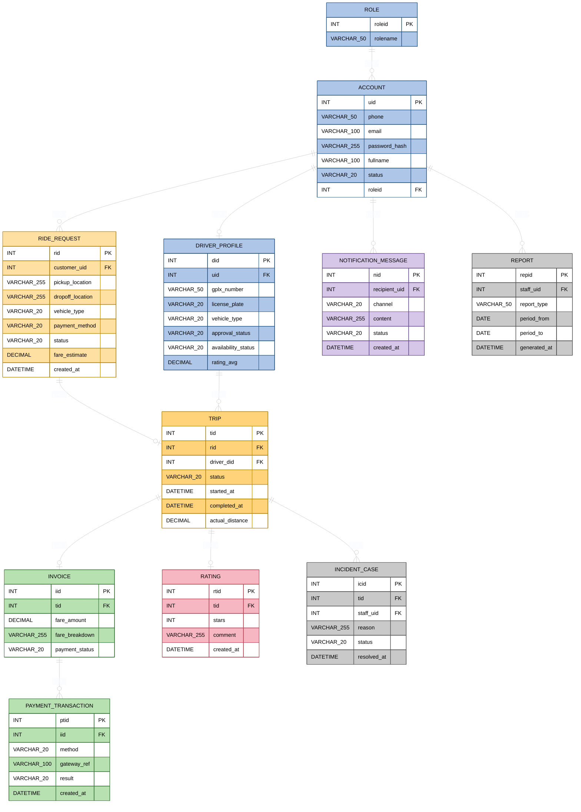

## 1. Domain Model Diagram

**Ghi chú quan hệ (đối chiếu đúng theo từng cạnh trong sơ đồ):**

| Quan hệ | Bậc (Cardinality) | Ý nghĩa nghiệp vụ |
|---|---|---|
| `ROLE → ACCOUNT` | 1 – 0..* | Một Role (Customer/Driver/Staff) được gán cho nhiều Account; mỗi Account chỉ giữ đúng 1 `roleid` (FK) để phân quyền truy cập hệ thống. |
| `ACCOUNT → DRIVER_PROFILE` | 1 – 0..1 | Một Account chỉ có tối đa 1 hồ sơ tài xế đi kèm — chỉ Account có role Driver mới phát sinh `DRIVER_PROFILE` khi đăng ký (UC02) và được duyệt (UC05). |
| `ACCOUNT → RIDE_REQUEST` | 1 – 0..* | Một Customer (Account) có thể tạo nhiều yêu cầu đặt xe theo thời gian (UC07); `RIDE_REQUEST.customer_uid` là FK trỏ về Account tạo yêu cầu. |
| `RIDE_REQUEST → TRIP` | 1 – 0..1 | Một yêu cầu đặt xe chỉ sinh ra tối đa 1 chuyến đi thực tế — chỉ khi có tài xế chấp nhận (UC10) mới phát sinh `TRIP`; nếu bị hủy (UC11) hoặc không tìm được tài xế thì không có Trip tương ứng. |
| `DRIVER_PROFILE → TRIP` | 1 – 0..* | Một tài xế có thể thực hiện nhiều chuyến đi theo thời gian; `TRIP.driver_did` là FK xác định tài xế đảm nhận chuyến (UC14). |
| `TRIP → INVOICE` | 1 – 0..1 | Một chuyến đi chỉ được tính cước chính thức đúng 1 lần sau khi hoàn thành (UC16); `INVOICE.tid` là FK bắt buộc trỏ về Trip đã Completed. |
| `INVOICE → PAYMENT_TRANSACTION` | 1 – 0..* | Một hóa đơn có thể phát sinh nhiều lần thử giao dịch thanh toán do thất bại rồi thử lại (UC19); mỗi `PAYMENT_TRANSACTION` gắn với đúng 1 Invoice qua FK `iid`. |
| `TRIP → RATING` | 1 – 0..1 | Một chuyến đi chỉ được đánh giá tối đa 1 lần (UC22); `RATING.tid` là FK duy nhất trỏ về Trip đã hoàn thành + đã thanh toán. |
| `ACCOUNT → NOTIFICATION_MESSAGE` | 1 – 0..* | Một Account (Customer hoặc Driver) nhận nhiều thông báo theo các sự kiện trong vòng đời chuyến đi (UC20, UC21); `recipient_uid` là FK. |
| `TRIP → INCIDENT_CASE` | 1 – 0..* | Một chuyến đi có thể phát sinh nhiều sự cố cần nhân viên vận hành can thiệp theo thời gian (UC23); `INCIDENT_CASE.tid` là FK, `staff_uid` là FK xác định nhân viên xử lý. |
| `ACCOUNT → REPORT` | 1 – 0..* | Một nhân viên/ban lãnh đạo (Account có role Staff) có thể tạo nhiều báo cáo thống kê theo các kỳ khác nhau (UC24); `REPORT.staff_uid` là FK. |

## 2. Ánh xạ Entity ↔ Aggregate ↔ Bounded Context ↔ Use Case

| Entity (sơ đồ) | Aggregate Root | Bounded Context | Use Case |
|---|---|---|---|
| `ROLE` | *(thuộc về Account)* | Identity & Account | — |
| `ACCOUNT` | `CustomerAccount` | Identity & Account | UC01, UC03, UC04 |
| `DRIVER_PROFILE` | `DriverProfile` | Identity & Account | UC02, UC05, UC06 |
| `RIDE_REQUEST` | `RideRequest` | Ride Booking & Dispatching | UC07, UC08, UC09, UC10, UC11 |
| `TRIP` | `Trip` | Trip Execution & Tracking | UC12, UC13, UC14, UC15 |
| `INVOICE` | `Invoice` | Billing & Payment | UC16 |
| `PAYMENT_TRANSACTION` | `PaymentTransaction` | Billing & Payment | UC17, UC18, UC19 |
| `NOTIFICATION_MESSAGE` | `NotificationMessage` | Notification | UC20, UC21 |
| `RATING` | `Rating` | Rating & Feedback | UC22 |
| `INCIDENT_CASE` | `IncidentCase` | Operations & Reporting | UC23 |
| `REPORT` | `Report` | Operations & Reporting | UC24 |

## 3. Chi tiết từng Bounded Context

### 3.1 Identity & Account (Core/Generic Subdomain)
- **Entity trong sơ đồ:** `ROLE`, `ACCOUNT`, `DRIVER_PROFILE`
- **Aggregate Root:** `CustomerAccount` (bao `ACCOUNT` + `ROLE`), `DriverProfile` (1-1 với `ACCOUNT` qua `uid`)
- **Value Objects:** `PhoneNumber`, `Email`, `PasswordHash`, `OtpCode`, `AccountStatus`, `AvailabilityStatus`
- **Domain Events:** `CustomerRegistered`, `DriverProfileSubmitted`, `DriverApproved`, `DriverRejected`, `DriverAvailabilityChanged`
- **Business Rule:** BR_SEC_01
- **Invariant chính:** `ACCOUNT.phone`/`email` duy nhất; `DRIVER_PROFILE.gplx_number`/`license_plate` duy nhất; `availability_status = Ready` chỉ khi `approval_status = Approved` và có GPS hợp lệ.

### 3.2 Ride Booking & Dispatching (Core Subdomain)
- **Entity trong sơ đồ:** `RIDE_REQUEST`
- **Aggregate Root:** `RideRequest` (chứa `fare_estimate` như thuộc tính, tương ứng Entity con `FareEstimate` ở mức nghiệp vụ)
- **Value Objects:** `GeoLocation` (`pickup_location`/`dropoff_location`), `VehicleType`, `PaymentMethodChoice`, `MatchingScore`
- **Domain Events:** `RideRequested`, `FareEstimated`, `DriverProposed`, `DriverAccepted`, `DriverRejected`, `DispatchTimedOut`, `NoDriverFound`, `RideCancelled`
- **Business Rules:** BR_MATCH_01, BR_MATCH_02, BR_MATCH_03, BR_PAY_01
- **Invariant chính:** `RIDE_REQUEST.status = "Đã có tài xế"` chỉ khi tồn tại đúng 1 `TRIP.rid` tương ứng; hủy chỉ hợp lệ khi `status ∈ {Đang tìm tài xế, Đã có tài xế}`.

### 3.3 Trip Execution & Tracking (Core Subdomain)
- **Entity trong sơ đồ:** `TRIP`
- **Aggregate Root:** `Trip` (`rid` FK về RideRequest, `driver_did` FK về DriverProfile)
- **Value Objects:** `ETA`, `GeoCoordinate`, `TripStatus`
- **Domain Events:** `DriverArrivedAtPickup`, `TripStarted`, `DriverLocationUpdated`, `TripCompleted`
- **Invariant chính:** `status` chỉ chuyển tuần tự Assigned → ArrivedPickup → InProgress → Completed; `completed_at` là điều kiện bắt buộc để tạo `INVOICE`.

### 3.4 Billing & Payment (Core/Supporting Subdomain)
- **Entity trong sơ đồ:** `INVOICE`, `PAYMENT_TRANSACTION`
- **Aggregate Root:** `Invoice` (chứa `fare_breakdown`), `PaymentTransaction` (nhiều bản ghi/1 Invoice)
- **Value Objects:** `Money`, `FareBreakdown`, `PaymentResult`
- **Domain Events:** `FareCalculated`, `PaymentSucceeded`, `PaymentFailed`, `CashPaymentConfirmed`, `PaymentRetryRequested`
- **Business Rules:** BR_PAY_01, BR_PAY_02, BR_PAY_03
- **Anti-Corruption Layer:** `PaymentGatewayAdapter` chuyển đổi model Gateway ↔ `PAYMENT_TRANSACTION.gateway_ref`.

### 3.5 Notification (Generic/Supporting Subdomain)
- **Entity trong sơ đồ:** `NOTIFICATION_MESSAGE`
- **Aggregate Root:** `NotificationMessage` (`recipient_uid` FK về Account)
- **Value Objects:** `Recipient`, `Channel`, `DeliveryStatus`
- **Domain Events:** `NotificationSent`, `NotificationFailed`, `NotificationRetried`
- **Business Rule:** BR_NOTI_01

### 3.6 Rating & Feedback (Supporting Subdomain)
- **Entity trong sơ đồ:** `RATING`
- **Aggregate Root:** `Rating` (`tid` FK về Trip)
- **Value Objects:** `Stars` (1–5), `Comment`
- **Domain Events:** `DriverRated`
- **Invariant chính:** Mỗi `TRIP` chỉ có tối đa 1 `RATING`; chỉ tạo khi `TRIP.status = Completed` và `INVOICE.payment_status = HoànTất`.

### 3.7 Operations & Reporting (Supporting/Generic Subdomain)
- **Entity trong sơ đồ:** `INCIDENT_CASE`, `REPORT`
- **Aggregate Root:** `IncidentCase` (`tid` FK về Trip, `staff_uid` FK về Account), `Report` (read model, `staff_uid` FK về Account)
- **Value Objects:** `ReportPeriod`, `ReportType`
- **Domain Events:** `IncidentLogged`, `IncidentResolved`, `ReportGenerated`
- **Business Rule:** BR_SEC_01

## 4. Phân loại Subdomain
| Loại | Bounded Context | Entity chính |
|---|---|---|
| **Core** | Ride Booking & Dispatching, Trip Execution & Tracking | `RIDE_REQUEST`, `TRIP` |
| **Supporting** | Billing & Payment, Rating & Feedback, Operations & Reporting | `INVOICE`, `PAYMENT_TRANSACTION`, `RATING`, `INCIDENT_CASE`, `REPORT` |
| **Generic** | Identity & Account, Notification | `ACCOUNT`, `DRIVER_PROFILE`, `NOTIFICATION_MESSAGE` |
